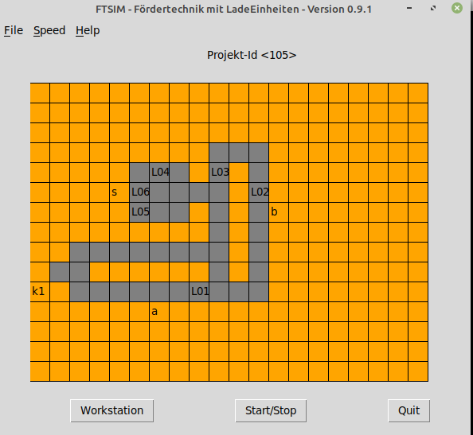

.. Sollte mit index.rst in docs abgestimmt sein !

FTSIM - Warehouse Transport Simulation
======================================

This project simulates and visualizes the transport of loadunits 
in a simple warehouse environment. 

Different layouts and optionaly orders are stored in a database
and can be used, changed, added by the users.

The loadunits can be transported in and between areas, like
conveyor belts, workstations for picking and storage areas.
This can be done manually, automaticly or driven by orders.

Work in progress
================

This Softwareproject `ftsim` is still **at work**, the documentation is not finished but live.
The software is  still on `test.pyp.org`  and should work under linux.
It will be moved to pypi in the next weeks, so it should be ready before christmas 21.

Audiance
========

The project can be used just for playing, or to train sql skills.
For developers the combination of tkinter, sqlite and threading
might be of interest. The main iussue in the beginning was
the question if the requested time of a batch of orders
is predictable.

Installation
============
The project does not need any extra packages, its all in
the standard library. 
Make sure that You are using Python3:

.. code-block:: text

    $ pip install ftsim

and run it:

.. code-block:: text

    $ ftsim

Documentation
=============

`<https://ftsim.readthedocs.io>`_

It will look like this
======================

