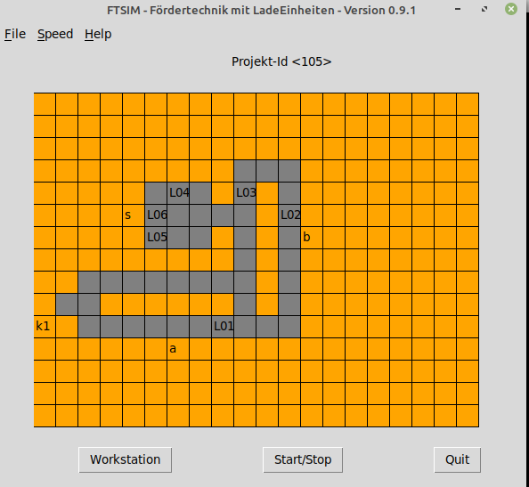

Getting Started
===============

Abstract
--------

FtSim simulates and visualizes the transport of loadunits in a simple warehouse environment.
Different layouts and optionaly orders are stored in a database and can be used, changed, added by the user.
The loadunits can be transported in and between areas, like conveyor belts, workstations for picking and storage areas.
This can be done manually, automatically or driven by orders.

A sample project might look like this.
Each :ref:`Location<basic_lf>` can hold one :ref:`Loadunit<basic_le>` (LE1, ...).
Each :ref:`Area<basic_ft>` has a name which is shown somewhere close to it. So ``Area a``
might be for example the main conveyor belt, forming a loop.
``Area s`` usually is a storage area and ``Area k1`` is a picking area.

Installing
----------

A MS-Windows installation contains all requested Modules.
On Linux/MacOS the graphical library ``Tk`` sometimes is missing,
so You have to install  ``tkinter`` or ``idle``, which is based on tkinter.

The installation is done with pip from the command line::

    $ pip3 install ftsim

or on Windows::

    C:\USERS\NAME> pip install ftsim

.. so just install  `ftsim` using pip_ ::

Basic usage
-----------

Start the Windows command line or a Linux/MaxOS terminal and type ftsim.

    $ ftsim

for more Information see chapter :ref:`How to use the Program<usage>` 
